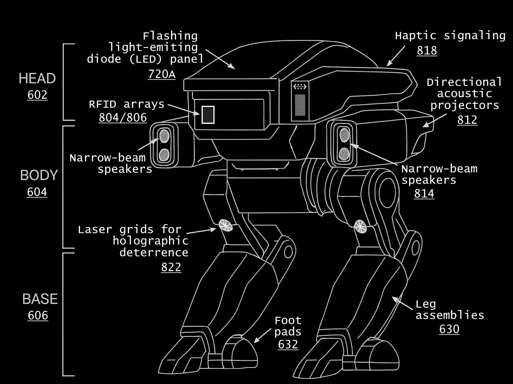

# 🐻 BEARHUG: Algorithms of Primal Synthetic Intelligence for small/low-power microcontrollers of non-weaponized/non-lethal urban pacification robots

Robotic technologies are increasingly being integrated into urban mobile security enforcement systems, reflecting a convergence of artificial intelligence (AI), sensor integration, and distributed computing in public safety operations. 

**BEARHUG** is a lightweight, real-time robotics framework designed for **small, low-power microcontrollers** (TinyML devices).  
It implements the three core algorithms from the BEARHUG paper:

- **PSI–A** — Multimodal perception + blacklight-based target estimation  
- **PSI–B** — Global geodesic planner (A* on occupancy grid)  
- **PSI–C** — Local Euclidean gradient controller  

The system is optimized for **sub-10 mW embedded robotics**.

---

### BEARHUG Architecture

